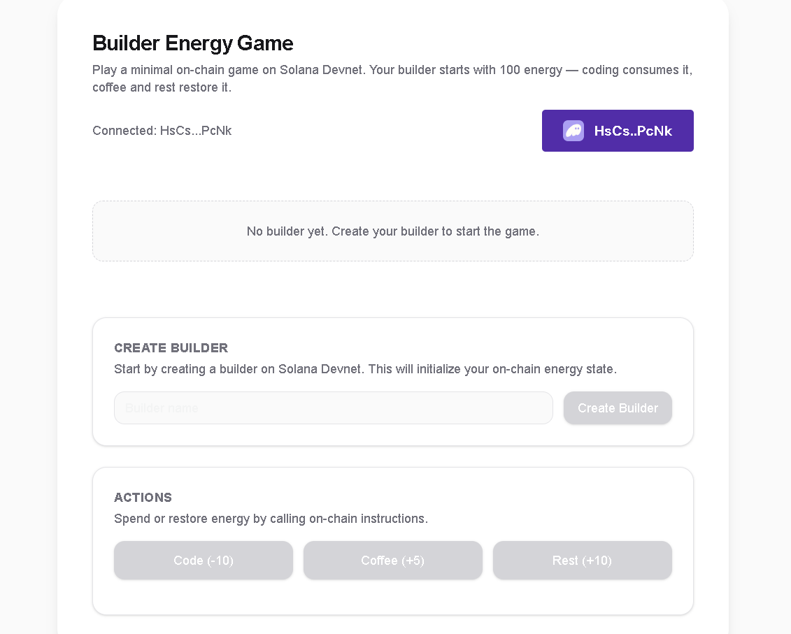

# Builder Energy Game


A minimal **on-chain game built on Solana using the Anchor framework**.

The project demonstrates how to manage user state on-chain using Rust smart contracts and interact with them through a simple frontend.

Developed as part of the **Solana Developer Certification**.



---

# Overview

Builder Energy Game is a simple blockchain application where a player (builder) has an **energy level stored on-chain**.

The player can perform actions that consume or restore energy through smart contract instructions.

All state changes occur directly on the Solana blockchain.

---

# Web3 Architecture

            ┌──────────────────────┐
            │     User Wallet      │
            │      (Phantom)       │
            └──────────┬───────────┘
                       │
                       ▼
            ┌──────────────────────┐
            │      Frontend        │
            │   Next.js + Web3.js  │
            └──────────┬───────────┘
                       │
                       ▼
            ┌──────────────────────┐
            │   Anchor Program     │
            │     (Rust / Solana)  │
            └──────────┬───────────┘
                       │
                       ▼
            ┌──────────────────────┐
            │    Builder Account   │
            │   (On-chain state)   │
            └──────────────────────┘


---

# Smart Contract

The smart contract is written in **Rust using the Anchor framework**.

It manages a **Builder account** that stores the player's state on-chain.

### Builder Account Structure

```rust
pub struct Builder {
    pub name: String,
    pub energy: u8,
    pub user: Pubkey,
}
```

The account tracks:

- builder name

- energy level

- owner public key


# Instructions (CRUD operations):

The program exposes several instructions to modify the builder state.

## Create

Creates a new builder account.

```rust
create_builder(name)
```

Initial state:

```rust
energy = 100
```

## Update

The following instructions update the builder state:

```rust
code()
```

Consumes energy:

```rust
coffee()
```

Restores energy:

```rust
rest()
```

## Read

- The frontend fetches the builder account state directly from the blockchain.

PDA Concept:

In this implementation the builder account is created using a generated keypair.


In a production implementation this account could be derived using a Program Derived Address (PDA):

```rust
seeds = ["builder", user_public_key]
```

This allows deterministic account generation for each user interacting with the program.

# Frontend

The frontend provides a simple interface to interact with the program.

Features:

Connect Phantom wallet

Create builder

Execute actions

Display energy stored on-chain

Deployment

The program was deployed to Solana Devnet.

Program ID:

```rust
5kUzw8RGMrZS2LLjq39NZfjzK22uoqv2SkjNyiRDc4qk
```

# Project Structure

builder-energy-game
│
├ programs/
│   └ builder-energy-game/
│       └ src/lib.rs
│
├ tests/
│
├ frontend/
│
└ README.md


# Running the Project

Clone the repository:

```rust
git clone <repository_url>
```

Install dependencies:

```rust
npm install
```
Run the frontend:

```rust
npm run dev
```

# Tech Stack

- Solana
- Rust
- Anchor Framework
- Web3.js
- Next.js
- Phantom Wallet
- Solana Devnet


---

# Security Considerations

The program ensures that the builder account is associated with the user who created it.

The `user` public key stored in the account represents the owner of the builder state.

Only transactions signed by the wallet interacting with the program are able to modify the builder account.

In a production implementation, additional security checks could be added to verify account ownership and enforce stricter access control.

---

# Future Improvements

Possible improvements for the project include:

- Implementing the builder account as a **Program Derived Address (PDA)**.
- Adding additional gameplay mechanics and actions.
- Expanding the frontend UI and improving user experience.
- Implementing events and logging for better on-chain activity tracking.

---

# Learning Outcomes

Through this project the following Solana development concepts were explored:

- Writing Solana smart contracts using **Rust**
- Using the **Anchor framework**
- Managing on-chain state with accounts
- Implementing CRUD-like interactions on-chain
- Connecting a frontend to a Solana program using **Web3.js**
